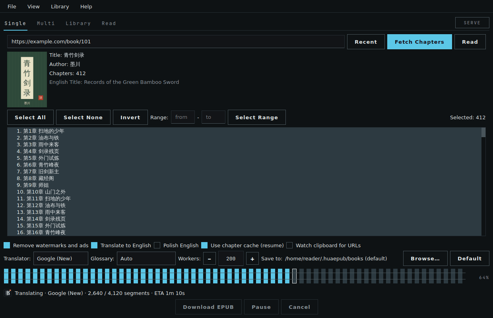
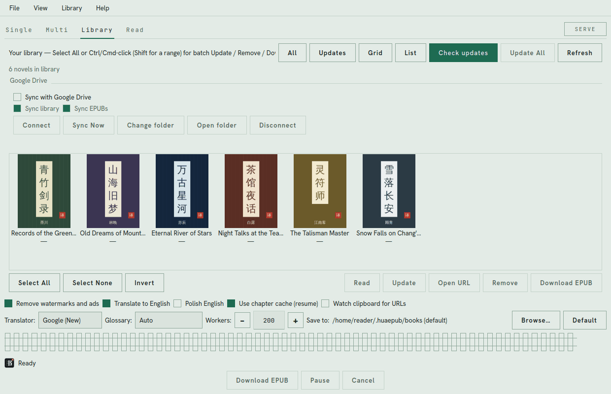
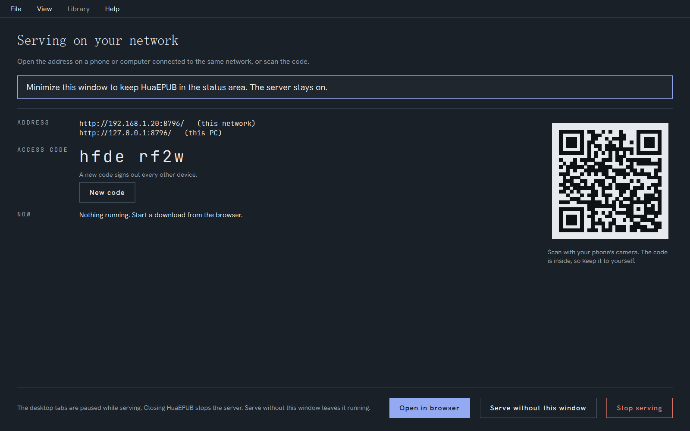
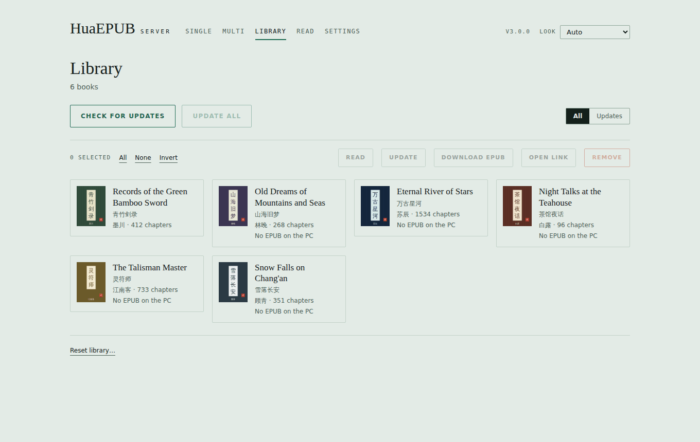

# HuaEPUB

Download Chinese web novels and build English EPUBs. Run from source on **Windows, macOS, or Linux** (Python 3.10+). Prebuilt executables are published for **Windows, macOS, and Linux**.

GUI is **PySide6 (Qt)**. Formerly *Novel Downloader & Translator* (CustomTkinter through 2.5).



<table>
  <tr>
    <td width="50%"></td>
    <td width="50%"></td>
  </tr>
  <tr>
    <td></td>
    <td align="center"> </td>
  </tr>
</table>

<sub>Screenshots use made-up demo books.</sub>

## Features

- **In-app reader** — **Read** tab (Library **Read** / double-click, or Single **Read** after fetch). Prefers the local EPUB (translated/polished English if that is what you downloaded). Otherwise it reads cached chapter HTML (usually the original site text) and fetches a missing chapter on demand — no EPUB rebuild, no translation/polish. Reading position stays in `~/.huaepub/reading.json` on this PC.
- **Server mode** — use HuaEPUB from a web browser on your phone, another computer or this PC. **This network** signs in with an access code (or a QR code); **Anywhere** uses HTTPS and a password. Single, Multi, Library, Read and Settings all work in the browser on the same library, cache and reading position. See [Server mode](#server-mode).
- **Looks** — View → **Look**: Auto follows your system (Catalogue at night when dark, Catalogue when light), or pick Indigo & Jade, Ink & Gold, Cinnabar Night, Blue Mist, or Surprise me. The browser pages use the same palettes.
- **Download novels** from hosts listed in `parsers/sites.json` (twkan, 69shuba, uukanshu, and hundreds of others)
- **Generic fallback parser** (experimental) — tries a best-effort download for any other novel site; if a configured site’s content selector misses, the same heuristic is used and the completion dialog warns you
- **Multi-download mode** — paste a block of novel URLs and download them sequentially with one click
- **Library mode** — cover-grid or list shelf, track novels, multi-select for batch update/remove/EPUB download, pull only new chapters, rebuild full EPUBs
- **Pause / Resume** — pause a long download, or close the app / shut down the PC and resume later from a banner on startup (local only)
- **Remove watermarks** and ads automatically (learns repeated site junk across about a dozen chapters, then a wider pass)
- **Translate to English** using Google (New/HTML/Old), Microsoft Edge, a LibreTranslate server, local **Ollama**, or **Offline NMT** (CTranslate2; optional xianxia/wuxia glossary)
- **Novel glossary** — Off by default, so names come straight from the translator. Auto applies the built-in cultivation pack only when the book looks like xianxia/wuxia. Urban/romance skip it. The pack is a curated web-novel list (not a general Chinese dictionary). Each book **mines names, sects, and techniques** from its own Chinese into `~/.huaepub/glossaries/<title>.json` (pinyin, not Google). If the polish Qwen GGUF is already on disk (7B+), a classify pass can fix those names; **Help → Polish glossaries with Qwen…** shows Accept all / Discard. It will not start a GGUF download. You do not need to edit the JSON by hand.
- **Polish English** — after Google or LibreTranslate, a fast local copy-edit (llama.cpp + Qwen). Only awkward MTL spans are rewritten; fluent sentences are copied. Ollama is not required. The first time you tick it, a dialog explains the local download (~2–9 GB into `~/.huaepub/polish`).
- **Chapter + translation cache** — stored in `~/.huaepub/cache.db` so re-runs and resumes skip network fetches. Default size cap is **2 GB** (Help → **Cache…**); oldest stored chapter HTML is deleted first. Nothing is cleared on a timer.
- **Create EPUB** files ready for e-readers, with volume-grouped table of contents when chapter titles carry volume prefixes. EPUBs are written to a sibling `.tmp` then replaced so a crash cannot leave a half-written file. EPUB 3 TTS overlays mark sentences so Google Play Books **Read Aloud** / Listen can speak the text (no baked audio; files stay small).
- **Select specific chapters** to download, including quick range selection (e.g. 200-450)
- **Progress tracking** with ETA (network/uncached work only — cached chapters do not fake “ETA 0s”), Pause, and Cancel. Status names the phase: fetching chapters, translating (including retry pass), polishing, or writing the EPUB. Failed chapters are retried at the end of the run. **Download EPUB** is disabled while a job is already running.
- **Completion notes** — leftover Chinese, heuristic chapter guesses, or a cancelled polish pass show as “Saved with warnings” (Single, Multi, and Library). A clean run still says Success / complete.
- **Keyboard** — **Y** / **N** confirm Yes/No dialogs (the underlined letters are not Alt-only). Window size and position are remembered.
- **Custom output folder** and persistent settings in `~/.huaepub/` (migrates from `~/.noveldownloader/` if present). `settings.json` is written atomically.
- **Auto-updater** — downloads prebuilt release builds, verifies `SHA256SUMS.txt`, then a helper replaces the binary and **reopens the app on every OS** (Windows, macOS, Linux, and source installs)
- **Log file** (`~/.huaepub/logs/huaepub.log`) — File → **Open log file**. Rotates at 1 MB during a long session (keeps `.log.1`). Crashes dump to `huaepub.fault.log` in the same folder.

## Installation

### Option 1: Run from Source (any OS)

Works on Windows, macOS, and Linux.

1. Install Python 3.10 or newer
2. Clone/download this folder
3. Install dependencies:
   ```bash
   pip install -r requirements.txt -r requirements-gui.txt
   ```
   A headless server (no window) only needs `requirements.txt`.
4. Run the app:
   ```bash
   python app.py
   ```

### Option 2: Prebuilt Executables (Windows, macOS & Linux)

Download the latest release from the [Releases](https://github.com/joelsnl/HuaEPUB/releases) page:
- `HuaEPUB-windows.zip`
- `HuaEPUB-macos.zip`
- `HuaEPUB-linux.zip`

Each zip is just `HuaEPUB` (`HuaEPUB.exe` on Windows). Each release also includes `SHA256SUMS.txt`.

### Option 3: Build Standalone Executable Yourself

1. Install dependencies + PyInstaller:
   ```bash
   pip install -r requirements.txt -r requirements-gui.txt
   pip install pyinstaller
   ```
2. Build:
   ```bash
   python build.py
   ```
3. Find the executable in `dist/`:
   - **Windows:** `HuaEPUB.exe`
   - **macOS / Linux:** `HuaEPUB`

## User Manual

HuaEPUB has four tabs at the top: **Single**, **Multi**, **Library**, and **Read**. Options below the main area (translate, clean, cache, workers, save folder) apply to downloads in all modes and are remembered between sessions. The **SERVE** chip at the right of the tabs turns on [Server mode](#server-mode).

### Quick start (one novel)

1. Stay on **Single**.
2. Paste the novel’s **table of contents** URL (the main book page, not a single chapter).
3. Click **Fetch Chapters**.
4. Select the chapters you want (or leave all selected).
5. Click **Download EPUB**.
6. When it finishes, the EPUB is in your Save folder (default `~/.huaepub/books`). You can also click **Read** after **Fetch Chapters** to preview from cache before building an EPUB.

### Options (what they mean)

| Option | What it does |
|--------|----------------|
| Remove watermarks & ads | Strips site junk; learns repeating ads from the first chapters (not Polish) |
| Translate to English | Machine-translates text while building the EPUB |
| Use chapter cache (resume) | Reuses chapters already saved on this PC |
| Watch clipboard for URLs | When on, copied novel URLs are queued into Multi (and fill Single if empty) |
| Translator | **Google (New)** (default, Calibre translate-pa), Google (HTML), Google (Old / gtx), **Microsoft Edge**, LibreTranslate, local **Ollama**, or **Offline NMT** |
| Polish English | After Google/LibreTranslate, local copy-edit on this PC. First tick shows a one-time size/path notice; the first run then downloads llama.cpp + a Qwen GGUF that fits this GPU (`~/.huaepub/polish`). Greyed out if Translate is off or Translator is already Ollama. |
| Translation Workers | Google in-flight **ceiling** (default 200). Starts at 8 GETs and climbs on success; a 429 pauses new requests so this IP can recover. LibreTranslate may pack several paragraphs per call. Ollama auto-drops to 2. Polish does not use this number. |
| Ollama model / URL | Shown only when Translator is Ollama (full local translation). If you have no models, HuaEPUB asks to download `qwen2.5:3b` (~2 GB). URL must be localhost. |
| Save to | Where EPUB files are written |
| Cache size | Help → **Cache…** — default 2 GB; `0` / Unlimited keeps everything. Oldest chapter HTML is deleted first; translations are kept unless the file is still over the cap. |

Keep **Use chapter cache** on unless you intentionally want a full re-download.

### Polish English (local copy-edit)

Keep **Translator** on **Google** (or LibreTranslate) and tick **Polish English**. Google still does the translation; a local LLM then copy-edits awkward English in the same EPUB.

- **Ollama is not required.** The first polish run downloads [llama.cpp](https://github.com/ggml-org/llama.cpp) (`llama-server`) and a **Qwen2.5 Instruct** GGUF into `~/.huaepub/polish`. Later runs reuse that.
- Model size follows this PC: roughly **3B** on CPU / low VRAM, **7B** on mid-range GPUs, **14B** when there is enough VRAM (NVIDIA CUDA, AMD Vulkan, or Apple Silicon). First download is a few GB.
- Only dirty MTL **spans** go to the GPU. Fluent Google sentences, titles, and Chinese leftovers are copied as-is. Polished spans are reused from the translations table in `cache.db`.
- If llama.cpp is already listening on `:8080` (or vLLM on `:8000`), that server is used instead of starting a new one.
- Progress and errors go to `~/.huaepub/logs/huaepub.log` (File → **Open log file**). Help → **How translation works** summarizes this in the app. Cancel during polish still **saves** the EPUB with Google/LibreTranslate English (already-polished sentences are kept).
- If Ollama is occupying the GPU so llama.cpp cannot start, polish can fall back to Ollama. Quit Ollama from the tray icon if you want the llama.cpp path.

### Offline NMT (CTranslate2)

Pick **Translator → Offline NMT** for a free local engine. This is not bundled in the prebuilt exe.

```bash
pip install -r requirements-nmt.txt   # ctranslate2 + sentencepiece + CUDA 12 libs
```

The first **translate** pass (after chapters are fetched) downloads Helsinki-NLP **opus-mt-zh-en** (CTranslate2, ~320 MB) into `~/.huaepub/nmt/` — not once per chapter. **Glossary** is Auto by default: the built-in web-novel pack (ranks like Grand Elder / Golden Core, plus cultivation items) is used only when the title or chapter list looks like cultivation. Romance, urban, and similar books skip it so 公子 is not forced to “Young Master.” That pack is **not** a general Chinese dictionary (pinning everyday words would wreck sentences). Character names are harvested from the book into `~/.huaepub/glossaries/<novel-title>.json` during the translate pass. You can also add names in `~/.huaepub/glossary.json` (same JSON shape as the polish glossary). Quality is below Google + Polish; use Polish English after Offline NMT if you want a copy-edit pass. The model stays on this PC.

#### GPU (NVIDIA)

CTranslate2 does **not** run on “the GPU is there.” It needs **CUDA 12** libraries, especially `cublas64_12.dll`. The Game Ready driver is not that. **CUDA 13 is the wrong major** (it ships `cublas64_13.dll`). cuDNN is not required for this model.

1. Use the **same Python** that launches `app.py`.
2. Install the CUDA 12 wheels (also pulled by `requirements-nmt.txt`):

```bash
python -m pip install nvidia-cublas-cu12 nvidia-cuda-runtime-cu12
```

3. **Fully quit and reopen** HuaEPUB (Python 3.8+ will not see new DLLs in an already-running process).

If GPU still fails after that:

- Windows: `winget install Nvidia.CUDA --version 12.9`  
  or the [CUDA 12.9 toolkit archive](https://developer.nvidia.com/cuda-12-9-0-download-archive) → Windows → x86_64 → exe. Runtime is enough.
- Linux: install CUDA **12.x** from NVIDIA or your distro, then reboot.
- macOS: CTranslate2 has no Metal backend here — Offline NMT stays on CPU.

Ollama’s `cuda_v12` folder is used automatically if Ollama is installed. If CUDA 12 still cannot load, the app falls back to **CPU Offline NMT** (not Google) and prints these same steps in the log.

### Local translation with Ollama

Ollama is only for **full** on-PC translation (no Google). It is much slower than Google + Polish. Install from [ollama.com](https://ollama.com). The suggested model is **`qwen2.5:3b`**: Apache-2.0, strong Chinese→English, about 2 GB, usable on CPU. Untagged `qwen2.5` can pull a much larger 7B+ build.

```bash
ollama list            # what you already have
# or let HuaEPUB ask to download qwen2.5:3b when you pick Ollama
```

In HuaEPUB set **Translator** to **Ollama**. Use 1–4 workers. Polish is greyed out in this mode (the model is already rewriting the whole book). Translations are cached.

### Pause, cancel, and resume after shutdown

Long downloads can take hours. You do not have to leave the PC on the whole time.

- **Pause** — stops between chapters. Click **Resume** to continue in the same session. Safe to close the app while paused.
- **Close the app** or shut down while a download is running / paused — progress is kept locally (`cache.db` + `active_download.json` under `~/.huaepub/`).
- **Next launch** — a banner appears: **Resume** or **Discard**. Resume continues from cached chapters.
- **Cancel** — clears the resume point (cached chapter text stays on disk). What gets written depends on the phase:
  - During chapter fetch or Chinese→English translation: the run **aborts** and **no EPUB** is written (a half-translated book is never saved).
  - During polish: the EPUB **is** saved with machine translation (already-polished sentences are kept). The completion dialog says so.

**Download EPUB** stays disabled while a job is running so a second run cannot start on top of the first.

Resume data is **local only**.

### Single mode (details)

1. Paste the book URL → **Fetch Chapters**.
2. Select chapters with Select All / None / Invert, or a **Range** (e.g. from `200` to `450`).
3. **Download EPUB** — progress names the phase (fetching chapters, translating, polishing, writing EPUB). The button is disabled while a job is running.
4. Use **Recent** to reopen a URL from earlier downloads.
5. If anything looks off (leftover Chinese, a generic content guess, or polish stopped early), the dialog title is **Saved with warnings**.
6. **Preview** on the completion dialog opens the book in the Read tab so you can check the EPUB you just wrote.

### Multi mode

1. Open the **Multi** tab.
2. Paste several book URLs (one per line, or a block of text containing URLs).
3. **Fetch All**, then **Download All**.
4. Novels run one after another. You can Pause / Cancel / resume the queue the same way as Single.
5. **Preview** on the completion dialog opens a finished EPUB in the Read tab (pick which novel if more than one succeeded).

### Library mode

After you download a novel, it appears in **Library** so you can update it later.

1. Open the **Library** tab.
2. Choose **Grid** (covers) or **List** (compact table).
3. Click **Check updates** — each cover shows status under the title (`Checking…`, `N new`, `Up to date`, or an error), and thumbnails are refreshed from the site.
4. Filter **All** or **Updates** (novels that have new chapters).
5. Select novels with **Select All** / **Select None** / **Invert**, or Ctrl/Shift-click. **Read** (or double-click / Enter) opens the current book in the **Read** tab. **Update** rebuilds a full EPUB for every selected book (one book uses the single updater; several use the same sequential queue as Update All). Old chapters come from cache. ETA is based only on chapters that still need a network fetch, so a 500-chapter update with 3 new chapters will not show “ETA 0s”.
6. **Update All** still updates every book Check has flagged, regardless of selection.
7. **Open URL** uses the current book. **Download EPUB** / **Remove** apply to the whole selection. **Remove** deletes the local EPUB, that novel’s chapter/cover/TOC cache, and the local reading position. Shared translation cache is kept.

The cover grid reflows when you resize the window and scrolls when there are more novels than fit on screen.

### In-app reader

**Read** opens the local EPUB when it is already in your books folder. Otherwise it uses the cached table of contents plus cached chapter HTML — usually the original site text, not the translated EPUB. The badge at the top says **EPUB** or **Cached** so that is not a surprise.

A missing cached chapter is fetched one at a time with the site delay (same as downloads). That writes the chapter to `cache.db` and shows it; it does not rebuild an EPUB or run translation/polish. If a download is already running, the fetch waits with a short status message.

Reading position (chapter + scroll) is stored only in `~/.huaepub/reading.json` on this PC. Removing a novel from the library also clears that book’s position.

Use **Prev** / **Next** and **A-** / **A+** (or the slider) in the reader. Font size is remembered as `reader_font_pt`.

### Server mode

Server mode turns HuaEPUB into a small web app you open in a browser. Click **SERVE** at the right end of the tab bar (or **File → Server mode…**) and pick where to serve:

| | This network | Anywhere |
|---|---|---|
| Who can reach it | Devices on your home or office network only | Any device on the internet (your router must forward the port to this PC) |
| Connection | HTTP | HTTPS only |
| Sign-in | 8-character access code, or scan the QR code | A password you set (at least 10 characters) |
| Session length | 30 days | 7 days |

While serving, the desktop window shows the addresses, the code or password status, a QR code, what the browser is doing right now, **Open in browser** (signs this PC's browser in with a one-time link) and **Stop serving**. The desktop tabs are paused so the browser and the window never run jobs on the same library at once; on this PC you use the browser too.

In the browser you get **Single**, **Multi**, **Library** (check, update, update all, remove, download EPUB, read), **Read** (the same `reading.json` position as the desktop reader) and **Settings** (translate, clean, cache, translator, glossary, workers, Polish, the books folder, and installing Polish, Offline NMT or an Ollama model). Finished EPUBs are saved in the books folder on the computer that is serving and added to the Library as usual; the browser can also save a copy to the device's Downloads folder. You can keep reading a cached chapter while a download runs. A missing chapter from the same site waits until that download is done. One download runs at a time, and an unfinished download shows a Resume banner in the browser just like on the desktop.

A headless server checks for an app update on its own and restarts into it. The desktop app still asks first.

**No window.** On a machine with no desktop (a Raspberry Pi over SSH):

```bash
pip install -r requirements.txt
python3 app.py --headless
```

That prints the address and the access code. About 20 seconds after it starts, and then every six hours, it checks GitHub for a newer release. A verified update is installed and the process restarts, unless someone has a book open or a download is running — then it waits and tries again. Under the systemd service (`Restart=on-failure`) the unit starts it again, so `--headless` stays. Help → Check for updates automatically in the desktop app turns this off. Settings in the browser can install a systemd user service when one is not already there (`python3 app.py --install-service` does the same and then exits). An existing `huaepub.service` or `noveldownloader.service` is left as it is. The service does not print the access code; it is in `~/.huaepub/server/secret.json`.

HuaEPUB remembers that server mode was on and starts serving again the next time it opens. If the port is taken, it says so and opens the desktop app instead.

**Security.** Everything is built in; there is no account or outside service.

- This network: only loopback and private-network addresses are answered, and the `Host` header must be an IP address or `localhost` (stops DNS-rebinding tricks). **New code** signs every device out.
- Anywhere: HTTPS with a certificate HuaEPUB makes for you (browsers warn the first time; compare the SHA-256 fingerprint shown on the PC) or your own certificate and key. The password is stored as a salted scrypt hash. Changing it signs every device out.
- Sessions are signed cookies (HttpOnly, SameSite=Strict, Secure over HTTPS). Every change needs a same-origin request with a custom header. After five wrong codes or passwords one address waits up to 15 minutes, and 30 failures from anywhere within 10 minutes pause all sign-ins for 10 minutes.
- **Find my public address** in the dialog asks `api.ipify.org` once, only when you click it.

### Where files live

| Path | Contents |
|------|----------|
| `~/.huaepub/books/` | Default EPUB output |
| `~/.huaepub/library.json` | Tracked library + recent history |
| `~/.huaepub/cache.db` | Chapter HTML, translations (including polished spans), covers, TOC snapshots. Local only; default 2 GB cap via Help → Cache… |
| `~/.huaepub/polish/` | llama.cpp + Qwen GGUF for Polish English (first-run download; stays on this PC) |
| `~/.huaepub/nmt/` | Optional Offline NMT CTranslate2 model (~320 MB; stays on this PC) |
| `~/.huaepub/glossary.json` | User novel terms (source/target). Always applied unless Glossary is Off |
| `~/.huaepub/glossary-qwen.json` | Legacy extra terms (read only for cultivation books; new passes write per-novel files) |
| `~/.huaepub/glossaries/` | Per-novel terms, including names harvested from that book |
| `~/.huaepub/active_download.json` | Incomplete download resume point (if any) |
| `~/.huaepub/reading.json` | In-app reader position (chapter + scroll) |
| `~/.huaepub/settings.json` | App options (atomic tmp+replace writes) |
| `~/.huaepub/server/` | Server mode: signing key, access code, password hash and the generated HTTPS certificate (owner-only) |
| `~/.huaepub/logs/huaepub.log` | Diagnostics (1 MB rotate during a session; keep `.log.1`) |
| `~/.huaepub/logs/huaepub.fault.log` | Native crash dumps (faulthandler) |

On Windows, `~` is your user folder (e.g. `C:\Users\YourName`).

### Auto-update & trust

- Updates install only when the downloaded zip matches the release’s `SHA256SUMS.txt` (fail closed if the sum is missing or wrong). There is no fallback to unsigned `main.zip`.
- Checksums and zips come from the **same** GitHub release — treat the [joelsnl/HuaEPUB](https://github.com/joelsnl/HuaEPUB) publisher account as your trust root (enable 2FA on that account).
- On **every OS** (Windows, macOS, Linux, and source installs), confirm the “update ready” dialog. The app **quits** so a small helper can replace the files and **reopen** HuaEPUB. Frozen Windows may swap the on-disk `.exe` first, then a hidden PowerShell helper deletes the backup and relaunches after exit. Frozen macOS/Linux use a shell helper (`/bin/sh` or `/bin/bash`), never the app binary itself.
- Need **2.10.1+** for a correct reopen of the **built** app. 2.9.2–2.10.0 could relaunch via Terminal/`python` on macOS (closing that session quit the app) and often failed to reopen on Windows. Older 2.6–2.9.1 builds often left the window closed after an update.
- Novel page / cover / LibreTranslate fetches block private/loopback hosts and re-check redirect targets. Translation still sends chapter text to Google or your LibreTranslate URL when enabled. Polish English stays on this PC.

### Tips

- Prefer the **main book page** URL from a supported site.
- For overnight runs: start the download, **Pause** or just close the app when you need the PC off, reopen later → **Resume**.
- If translation is rate-limited, lower **Translation Workers** (e.g. 30–50) and keep cache on.
- Menus:
  - **File** — Open books folder, Open data folder, Open log file
  - **Library** — Check for updates, Reset library…
  - **Help** — Check for updates, Auto-check on startup, How translation works…, **Cache…**, About

## Supported Sites

| Site | URL Pattern | Status |
|------|-------------|--------|
| twkan.com | `https://twkan.com/book/{id}.html` | ✅ Working |
| 69shuba.com | `https://69shuba.com/book/{id}/` | ✅ Working |
| uukanshu.cc | `https://uukanshu.cc/book/{id}/` | ✅ Working |
| Other configured hosts | see `parsers/sites.json` | ✅ Best-effort (CSS selectors) |
| Unlisted sites | any novel table-of-contents URL | 🧪 Experimental (generic parser) |

## Adding New Sites

Add an object to `parsers/sites.json`. First matching `domains` entry wins. `generic.py` stays last as a heuristic fallback. If a configured site’s `content` selector misses, the same density heuristic is used, `Chapter.used_heuristic` is set, and the completion dialog warns you.

```json
{
  "name": "example.com",
  "domains": ["example.com"],
  "title": "h1",
  "author": ".author",
  "content": ["#chapter"],
  "chapter_list": "ul.toc a"
}
```

Optional fields: `description`, `cover`, `chapter_title`, `remove`, `toc_link`, `reverse`, `delay`, `encoding`, `language`, `book_id` (regex), `chapter_list_url` (may include `{book_id}`), `chapter_href_contains`, `referer`, `visit_toc_first`, `chapter_list_next` (CSS selector for the next TOC page), `content_next` (CSS selector for the next *page of this chapter* — not 下一章). Configured sites follow those keys only; the generic parser follows `rel=next` on TOCs and 下一页 / next page on chapter bodies.

## Running Tests

The test suite is fully offline (HTML fixtures, no network needed):

```bash
pip install -r requirements.txt -r requirements-gui.txt -r requirements-dev.txt
python -m pytest tests/
python -m ruff check .
```

CI runs this suite on Ubuntu, Windows, and macOS (Python 3.11 and 3.12). A `v*` tag build waits for the same tests before PyInstaller runs (pinned `pyinstaller==6.22.2`).

## Project Structure

```
.
├── app.py              # Entry → gui.app.run()
├── gui/                # PySide6 UI (main window, pages, workers, Slips theme)
├── web/                # Server mode: FastAPI app, sign-in, TLS, browser pages (web/static)
├── requirements.txt    # Server and download dependencies
├── requirements-gui.txt # Desktop window (PySide6)
├── requirements-dev.txt # pytest, ruff, pinned PyInstaller
├── build.py            # PyInstaller build (regenerates HuaEPUB.spec; do not commit a stale spec)
├── core/
│   ├── branding.py     # Product name + legacy aliases
│   ├── parser.py       # Base parser class + registry
│   ├── cleaner.py      # Watermark/ad removal
│   ├── translator.py   # Translation (Google / LibreTranslate / Ollama)
│   ├── ollama_setup.py # Ollama install / GPU / probe / pull
│   ├── local_polish.py # Polish English entry (KEEP/REPLACE)
│   ├── polish/         # llama.cpp serve + span copy-edit (pinned hosts + hashes)
│   ├── epub_builder.py # EPUB creation (atomic write; skip second clean after translate)
│   ├── download_runner.py  # Pause/cancel/chapter download + translate_then_build
│   ├── tasks.py        # Single / Multi / Library update jobs shared by desktop and server
│   ├── session.py      # Shared app state (settings, cache, library, download control)
│   ├── settings.py     # Persistent app settings (atomic tmp+replace)
│   ├── cache.py        # Chapter + translation + cover + TOC caches (SQLite, 2 GB LRU)
│   ├── download_job.py # Local incomplete-download resume
│   ├── reading.py      # Local reading position
│   ├── reader.py       # In-app reader: EPUB vs cache HTML
│   ├── library.py      # Library + history store
│   ├── security.py     # SSRF guards, safe zip/tar extract, secret file perms
│   ├── notify.py       # Desktop notifications
│   ├── logger.py       # Log-to-file setup
│   └── updater.py      # Auto-updater (version + GitHub releases + relaunch helper)
├── parsers/
│   ├── sites.json      # Host + CSS selector configs
│   ├── config.py       # Single parser that reads sites.json
│   ├── pagination.py   # TOC / chapter-body next-page walks
│   └── generic.py      # Fallback parser for other sites
└── tests/              # Offline pytest suite
```

## Troubleshooting

### Polish English is greyed out
- Turn on **Translate to English**
- Set **Translator** to Google or LibreTranslate (not Ollama — that already translates locally)

### Polish English
- Does **not** need Ollama
- First run downloads llama.cpp + a Qwen2.5 Instruct GGUF that fits this GPU (into `~/.huaepub/polish`). Later runs skip the download.
- NVIDIA / AMD / Apple Silicon use CUDA / Vulkan / Metal; otherwise CPU (3B, slower)
- If llama.cpp is already on `:8080` (or vLLM on `:8000`), that server is used
- Only awkward MTL spans are sent to the GPU; fluent Google English is copied
- Writes the same EPUB as a normal translated download (no extra polished copy)
- Progress and errors go to `~/.huaepub/logs/huaepub.log` (File → **Open log file**)
- If polish never starts and the log mentions GPU busy: quit **Ollama** from the tray (Quit Ollama), then retry
- Cancel during polish still writes the EPUB with Google/LibreTranslate English

### "Translation failed" errors
- Reduce the workers ceiling if Google still 429s after the auto-throttle (try 16–32)
- A 429 pauses **new** Google requests (in-flight cap starts at 8, floor 2, climbs on success). Letting 200 workers keep going just 429s until nothing translates.
- If some segments persistently fail to translate, the app gives up after a
  few retry passes, keeps the best available text, and builds the EPUB anyway
  instead of getting stuck
- If a finished book still has whole chapters in Chinese, re-run Translate.
  Failed Chinese is no longer kept as a cache hit. Help → **Cache…** can
  clear translations if you want a clean slate.

### "Could not extract book ID"
- Make sure you're using the main novel page URL
- Check that the site is supported

### EPUB won't open
- Try a different reader (Calibre recommended)
- Check if the novel has special characters in the title

### Resume banner does not appear after closing mid-download
- Confirm the download had started (chapters were being fetched)
- Check that `~/.huaepub/active_download.json` exists; if you clicked **Cancel**, the resume point was cleared on purpose
- Cached chapters still help if you fetch the same book again with cache enabled

### Cancel wrote no EPUB / still wrote an EPUB
- Cancel **during translation** is supposed to write nothing (avoids a half-translated book).
- Cancel **during polish** is supposed to save the EPUB with machine translation.
- Cached chapter HTML is kept either way.

### Cache grew huge / old chapters disappeared
- Default cap is 2 GB. Help → **Cache…** to raise it, set Unlimited, or clear chapters vs everything.
- Over the cap, oldest stored chapter HTML is deleted first. Translations are kept unless the file is still over the limit. Nothing is cleared on a timer.

### Update installed but the app does not reopen (any OS)
- Confirm you are on **2.10.1+**. 2.9.2–2.10.0 could reopen a Terminal/`python` session on macOS instead of the `dist` binary, and on Windows the helper was often killed with the old process so nothing reopened. Older onefile builds could also fail to relaunch (PyInstaller treated the new process as a worker of the dying extract). Polish English in **2.9+** uses llama.cpp (Ollama is not required); 2.7.x used Ollama for polish.
- After “Update ready”, allow the app to quit; do not force-quit the helper. It should reopen itself. If it does not, start `HuaEPUB` from the same folder you installed into.
- If it still fails, download the OS zip from [Releases](https://github.com/joelsnl/HuaEPUB/releases) and replace the binary manually. On macOS, clear quarantine if Gatekeeper blocks it: `xattr -cr /path/to/HuaEPUB`.

### Update refused / checksum error
- The release may be incomplete, or the download was corrupted — try again later, or install the zip from Releases manually after checking `SHA256SUMS.txt`.

## Architecture

[docs/architecture.html](docs/architecture.html) is a standalone diagram of HuaEPUB 3.0: the desktop app and server mode sharing one session and one set of job code, and how a download moves from a URL through parse, clean, translate, polish, and EPUB. Open it in a browser. It was made with [Archify](https://github.com/tt-a1i/archify).

## Credits

- Inspired by [WebToEpub](https://github.com/dteviot/WebToEpub) (dteviot, Apache-2.0); some site CSS selectors in `parsers/sites.json` are adapted from it
- Translation logic from fixTranslate.py
- Polish English uses [llama.cpp](https://github.com/ggml-org/llama.cpp) and [Qwen2.5](https://huggingface.co/Qwen) Instruct GGUFs
- Uses [ebooklib](https://github.com/aerkalov/ebooklib) for EPUB creation
- GUI built with [PySide6](https://doc.qt.io/qtforpython/) (Qt)

## Disclaimer

HuaEPUB is a personal utility for fetching and packaging web novel pages that are already publicly reachable in a browser. It does **not** grant you any rights to the novels themselves.

- Many novels on aggregator / mirror sites are uploaded **without the copyright holder's permission**. Downloading, copying, translating, or redistributing that material may violate copyright law in your country.
- You are solely responsible for how you use this tool and for complying with applicable laws, site terms of service, and the rights of authors, publishers, and platforms.
- Automatic translation does **not** create a legal license to keep or share the work. Machine-translated EPUBs are still derived from the original copyrighted text.
- This project is **not affiliated with**, endorsed by, or connected to twkan, 69shuba, uukanshu, Google, Google Play Books, or any novel publisher.
- The software is provided **as is**, without warranty. The authors are not liable for misuse, account bans, takedown notices, or legal claims arising from your use of it.

If you enjoy a novel, support the author through official channels whenever possible.

## License

MIT License - Feel free to modify and distribute.
