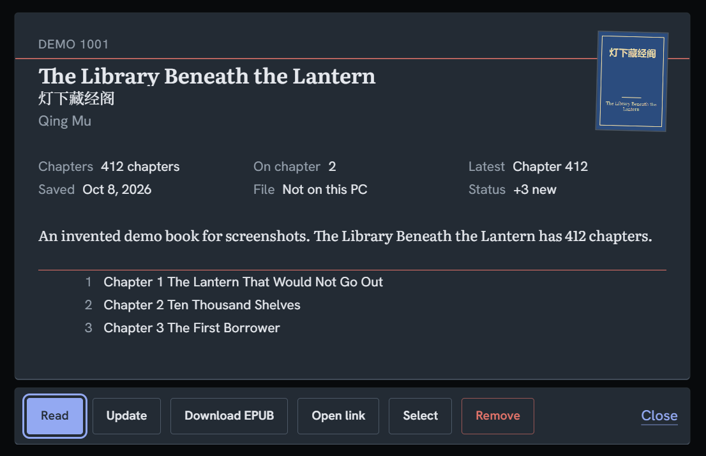
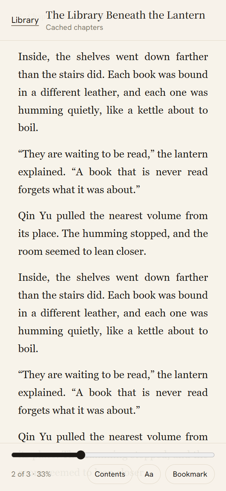

# HuaEPUB

Download Chinese web novels, translate them to English, and read them as EPUBs: on your desktop, or
from your phone through a built-in web app. Runs on **Windows, macOS and Linux**; prebuilt
downloads are published for all three. (Formerly *Novel Downloader & Translator*.)


<table>
  <tr>
    <td width="50%"></td>
    <td width="50%"></td>
  </tr>
  <tr>
    <td></td>
    <td align="center"> </td>
  </tr>
</table>

<sub>Screenshots use made-up demo books (`python tools/make_demo_home.py <folder>` builds that library).</sub>

## What it does

- **Download** a novel from its table-of-contents link. Hundreds of sites are configured in
  `parsers/sites.json`, and a generic fallback tries any other. Pick the whole book or a range of
  chapters, one novel or a pasted block of links.
- **Translate to English** with Google, Microsoft Edge, a LibreTranslate server, a local Ollama
  model, or an offline model. Optionally keep names consistent with a glossary, and copy-edit the
  result with a **local** language model. See [translation](docs/translation.md).
- **Build clean EPUBs.** Watermarks and ads are removed, the table of contents is grouped by volume,
  and files carry Read Aloud overlays so Google Play Books can speak them.
- **Keep a library.** Track novels, check for new chapters, and update only what's new. Shelve a
  book you gave up on so you'll recognise it next time.
- **Read anywhere.** Use the built-in reader, or turn on **server mode** to open the same library
  from a phone or another computer, with page-turning like a reading app.
- **Pause and resume.** Stop a long download, close the app or shut down the PC, and carry on later.
- **Stay local.** Your library, cache and reading positions live in `~/.huaepub/` on your machine.
  Updates are downloaded only when they match the release's published checksum.

## Install

**Prebuilt (easiest).** Download the zip for your system from the
[Releases](https://github.com/joelsnl/HuaEPUB/releases) page (`HuaEPUB-windows.zip`,
`HuaEPUB-macos.zip` or `HuaEPUB-linux.zip`), unzip, and run `HuaEPUB`. Each release includes
`SHA256SUMS.txt`.

**From source** (any OS, Python 3.10+):

```bash
git clone https://github.com/joelsnl/HuaEPUB.git
cd HuaEPUB
pip install -r requirements.txt -r requirements-gui.txt
python app.py
```

A headless server (no window) needs only `requirements.txt`:

```bash
pip install -r requirements.txt
python3 app.py --headless
```

**Build the executable yourself:** `pip install pyinstaller` (the pinned version is in
`requirements-dev.txt`), then `python build.py`. The result is in `dist/`.

## Quick start

1. Open HuaEPUB; you start on the **Single** tab.
2. Paste the novel's **table of contents** link (the main book page, not one chapter).
3. Click **Fetch Chapters**, choose the chapters you want, then **Download EPUB**.
4. The EPUB is saved in `~/.huaepub/books` and the book is added to your **Library**.

To read on your phone, click **SERVE** at the right of the tabs and scan the QR code. More in the
[user guide](docs/user-guide.md) and [server mode](docs/server-mode.md).

## Documentation

| | |
|---|---|
| [User guide](docs/user-guide.md) | The tabs, options, the Library, pause and resume, the reader, where files live |
| [Translation](docs/translation.md) | Engines, rate limits, the glossary, Polish English, offline and Ollama setup |
| [Server mode](docs/server-mode.md) | The browser app, running headless on a Raspberry Pi, security |
| [Troubleshooting](docs/troubleshooting.md) | Common problems and what to do |
| [Architecture](docs/architecture.md) | How the pieces fit together |
| [Development](docs/development.md) | Setup, tests, adding a site, releasing |

## Supported sites

| Site | URL pattern | Status |
|------|-------------|--------|
| twkan.com | `https://twkan.com/book/{id}.html` | Working |
| 69shuba.com | `https://69shuba.com/book/{id}/` | Working |
| uukanshu.cc | `https://uukanshu.cc/book/{id}/` | Working |
| Other configured hosts | see `parsers/sites.json` | Best effort (CSS selectors) |
| Unlisted sites | any novel table-of-contents link | Experimental (generic parser) |

To add one, see [Adding a site](docs/development.md#adding-a-site).

## Credits

- Inspired by [WebToEpub](https://github.com/dteviot/WebToEpub) (dteviot, Apache-2.0); some site CSS
  selectors in `parsers/sites.json` are adapted from it.
- Translation logic from fixTranslate.py.
- Polish English uses [llama.cpp](https://github.com/ggml-org/llama.cpp) and
  [Qwen2.5](https://huggingface.co/Qwen) Instruct GGUFs.
- EPUBs are built with [ebooklib](https://github.com/aerkalov/ebooklib), the desktop window with
  [PySide6](https://doc.qt.io/qtforpython/) (Qt), and the browser app is served with FastAPI.

## Disclaimer

HuaEPUB is a personal utility for fetching and packaging web novel pages that are already publicly
reachable in a browser. It does **not** grant you any rights to the novels themselves.

- Many novels on aggregator and mirror sites are uploaded **without the copyright holder's
  permission**. Downloading, copying, translating or redistributing that material may violate
  copyright law in your country.
- You are solely responsible for how you use this tool and for complying with applicable laws, site
  terms of service, and the rights of authors, publishers and platforms.
- Automatic translation does **not** create a legal license to keep or share the work.
  Machine-translated EPUBs are still derived from the original copyrighted text.
- This project is **not affiliated with**, endorsed by, or connected to twkan, 69shuba, uukanshu,
  Google, Google Play Books, or any novel publisher.
- The software is provided **as is**, without warranty. The authors are not liable for misuse,
  account bans, takedown notices or legal claims arising from your use of it.

If you enjoy a novel, support the author through official channels whenever possible.

## License

MIT License. Feel free to modify and distribute.
