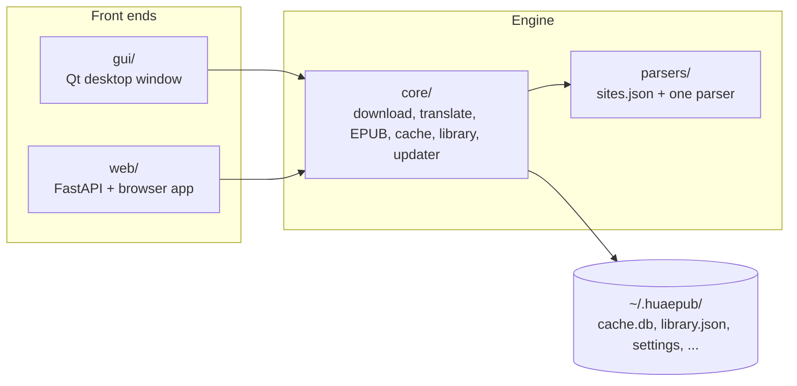
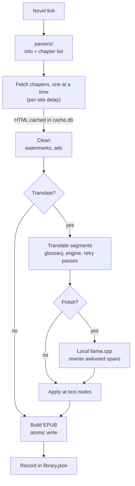
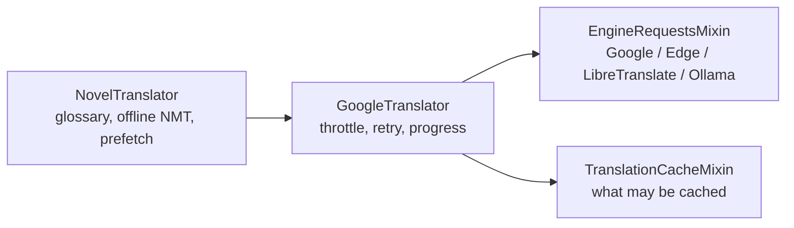
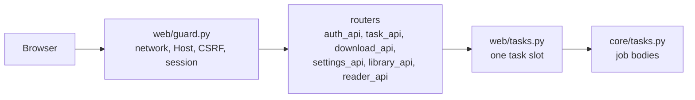

# Architecture

HuaEPUB is one Python program with two front ends over the same engine: a **desktop window**
(PySide6 / Qt) and a **browser app** served by the same process (FastAPI). Everything that
downloads, translates, builds EPUBs or stores data lives in `core/` and never imports either
front end.

## The three layers

| Layer | Folder | May import | Must not import |
|-------|--------|------------|-----------------|
| Engine | `core/`, `parsers/` | each other, third-party libraries | `gui`, `web`, Qt |
| Browser app | `web/` | `core` | `gui`, Qt |
| Desktop window | `gui/` | `core`, and `web.host` / `web.auth` to start and describe the server | the rest of `web` |

`tests/test_server_mode.py` enforces the first two rows: it imports every module under `web/` in
a clean interpreter and fails if Qt or `gui` got loaded, and it scans `core/`, `parsers/` and
`web/` for forbidden imports.

### One session, one set of job code

`core/session.py` holds the shared state (settings, the SQLite cache, the library store and the
`DownloadControl` that carries pause and cancel). The desktop window and the server each hold one.
The jobs themselves (`core/tasks.py`: Single, Multi, Library update, Update all) are Qt-free
functions; the Qt workers in `gui/workers/` and the task bodies in `web/books.py` are thin
wrappers around them. Logic is never forked back into a front end.

While the server runs, the desktop tabs are replaced by a server screen, so the window and the
browser never run jobs on the same library at once. The browser is the app.

## How a download flows

- **Fetching is sequential on purpose.** Sites ban fast scrapers, so each site has a
  `request_delay` and chapters are never fetched in parallel. Translation, which hits a different
  host, is concurrent.
- **Everything is cached** (`core/cache.py`): chapter HTML, translated segments, covers and
  chapter lists. A resumed or repeated run skips what it already has.
- **The orchestration** is `core/download_runner.py`: pause and cancel, the chapter loop, and
  `translate_then_build` (clean, translate, polish, apply, write). The status text and ETAs come
  from `core/translation_progress.py`.
- **Cancel semantics:** cancelling during fetch or translation aborts and writes no EPUB (a
  half-translated book is never saved); cancelling during polish still writes the EPUB with the
  machine translation.

## Translation

- `core/translator.py`: `GoogleTranslator` (despite the name, it drives every engine) runs a
  translation job: a thread pool, a per-IP throttle (`core/gtx_throttle.py`), bounded multi-pass
  retry, progress.
- `core/translator_engines.py`: one `_request_*` method per engine.
- `core/translator_cache.py`: `is_usable_translation` (an echoed Chinese chapter never counts as
  done) and the in-memory and SQLite cache helpers.
- `core/translation/`: `NovelTranslator` extends the above with the glossary
  (protect names before translating, restore after), the optional offline CTranslate2 model and
  chapter prefetch.
- `core/polish/`: the optional local copy-edit through llama.cpp.

See [translation.md](translation.md) for how this behaves from the user's side.

## Server mode

- `web/server.py` only wires the app together. Every request passes through `web/guard.py`
  (client network, `Host` header, body size, same-origin and custom header on writes, session
  cookie, security headers). Each router module is a `build_router(ctx)` over the shared
  `ServerContext` (`web/context.py`).
- `web/tasks.py` is the single task slot: one download, check or lookup at a time, shared by all
  browsers, with reader fetches borrowing it for a few seconds.
- `web/host.py` starts and stops the uvicorn thread inside the desktop process (or runs headless
  with no window). `web/auth.py` holds the sign-in secrets and rate limits; `web/tls.py` makes the
  HTTPS certificate for the "Anywhere" mode.
- The browser app is plain HTML, CSS and JavaScript in `web/static/`, with no build step and a
  strict content security policy (`script-src 'self'`).

See [server-mode.md](server-mode.md) for the user-facing side and the security model.

## Data on disk

Everything lives under `~/.huaepub/` and never leaves the machine except what a translation
engine is sent. `core/settings.py` owns the location; the file table is in the
[user guide](user-guide.md#where-files-live).

Writes that must not corrupt on a crash go through `core/atomic_io.py` (write a sibling temp
file, then replace). EPUBs use `write_epub_atomic`.

## Updates

`core/updater.py` checks GitHub releases, downloads the asset for this platform, **verifies it
against the release's `SHA256SUMS.txt` (and refuses to install without a match)**, then runs a small
helper that waits for the app to exit, swaps the files and relaunches. The helper scripts are plain
text in `core/update_scripts.py`; paths and the expected hash reach them through a JSON file, never
by string interpolation.

## Where to look

| I want to change... | Start here |
|---------------------|------------|
| Support a new site | `parsers/sites.json` ([development.md](development.md#adding-a-site)) |
| How text is cleaned | `core/cleaner.py` |
| EPUB layout | `core/epub_builder.py` |
| A translation engine | `core/translator_engines.py` |
| Status text or ETA while translating | `core/translation_progress.py` |
| The desktop window | `gui/main_window.py` and the mixins in `gui/window/` |
| A browser page | `web/static/` and the matching `web/*_api.py` router |
| Update installation | `core/updater.py`, `core/update_scripts.py` |
